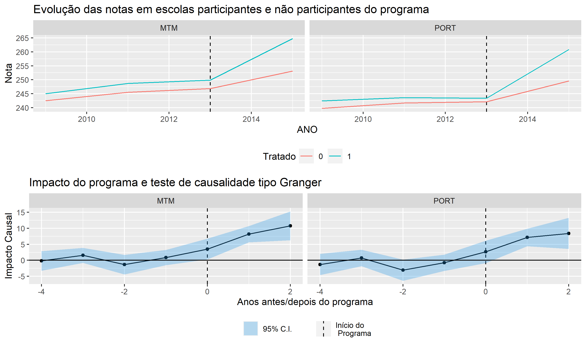

# Avaliação de Impacto de um programa de Escola Integral

    
    
Evolução das notas e impacto causal do programa

## Sobre este projeto - Avaliando o Programa de Escola Integral de São Paulo (PEI)
Este trabalho estima o impacto causal do PEI no desempenho de alunos do Ensino Fundamental de escolas públicas. A evolução do impacto também é estimada. Os resultados indicam que o programa em questão melhora a proficiência dos alunos em matemática e em português, e que este resultado é amplificado quanto maior o tempo que a escola permanece no programa. Além disto, podemos inferir que os resultados não são frutos do simples aumento de horas-aula, mas também das mudanças pedagógicas e gerenciais.

O código e os dados disponibilizados neste repositório são parte de um artigo acadêmico sobre o programa. Neste repositório, estão presentes as seguintes etapas do projeto:

- Agregação de microdados
- Criação de variáveis explicatórias
- Estimação de impacto causal: Diferenças-em-diferenças
- Estimação de impacto causal e teste de causalidade: *Leads and Lags*
- Visualização dos resultados

## Ferramentas utilizadas
R (plm, ggplot2, dplyr, reshape2, readr, Amelia)

## Breve explicação sobre as partes do projeto
### 1. Dados
Os dados sobre as escolas foram coletados do Censo Escolar e da Prova Brasil, e os dados sobre a participação das escolas no PEI foram disponibilizados pela Secretaria de Educação de SP por meio da Lei de acesso à informação. Os dados foram agregados por escola (por exemplo, média dos alunos da escola na Prova Brasil, proporção de alunos da escola com mães que completaram o ensino superior, etc.). 

### 2. Diferenças-em-diferenças
O método de diferenças-em-diferenças é amplamente utilizado para avaliação de impacto quase experimental. O grupo de controle são todas escolas estaduais de SP que não participam do PEI. Como o gráfico de evolução das notas indica, parece haver uma tendência comum entre o grupo de tratamento e o grupo de controle até o início do programa. A estratégia diferenças-em-diferenças também é interessante pois permite que controlemos por variáveis explicativas observáveis que variam no tempo, e não-observáveis fixas no tempo.

### 3. *Leads and Lags*
Este método é útil quando a dimensão temporal do programa pode ser importante, ou seja, o impacto varia no tempo (diminuindo ou reduzindo). O método também serve como um teste de causalidade (ao resporder a pergunta: se o fingirmos que o programa aconteceu quando não aconteceu, será que observamos impacto?). Detalhes sobre o método podem ser encontrados neste [artigo](https://www.journals.uchicago.edu/doi/abs/10.1086/344122).

### 4. Resultados
Os resultados apontam para um impacto causal positivo do programa, e que este impacto aumenta com o passar dos anos. Além disto, nas estimações foram includídas variáveis *dummy* indicando se a escola em questão praticava jornada de aula maior que 7 horas (ensino integral). Os resultados apontam que o simples aumento de horas-aula não é um correlato de desempenho melhor. O mecanismo pelo qual o programa aumenta a nota dos alunos parece ser a mudança no currículo, na gestão, e na contratação de professores. Além disto, um fator que melhora a nota das escolas participantes também é a atração de "estudantes diferentes". 

## Extensões
A partir destes resultados um estudo acadêmico foi submetido e está sob análise. Neste artigo a questão do mecanismo pelo qual o programa funciona é melhor explorado, e análises de robustez dos resultados também são feitas.

## About me
**Made with ❤️ by Ian Fukushima | [LinkedIn](https://linkedin.com/in/ian-fukushima) | [GitHub](https://github.com/isfuku) | [Kaggle](https://www.kaggle.com/ianfukushima)**

